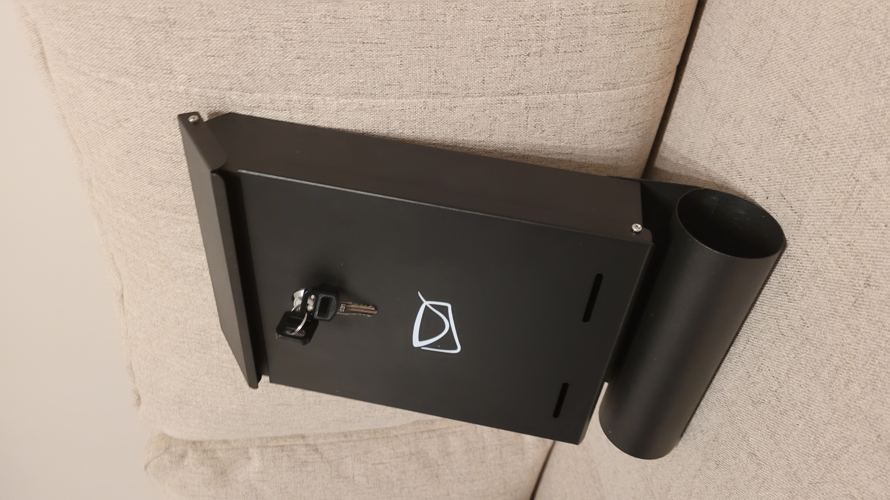
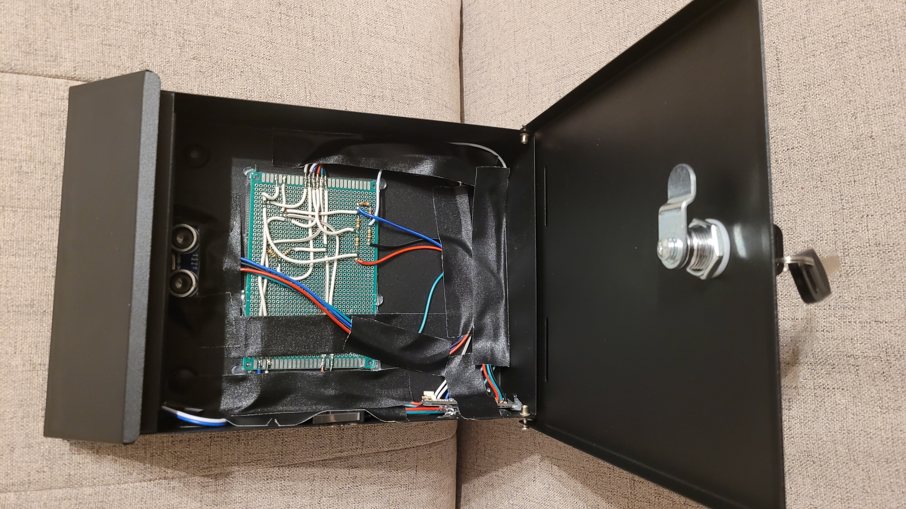
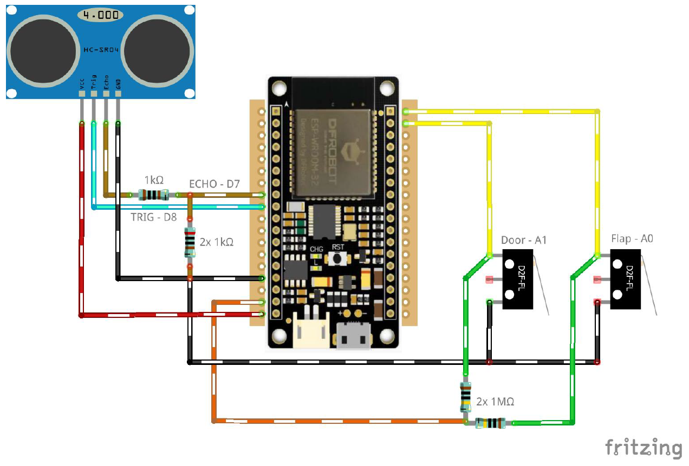

# 📬 ESP32 Smart Mailbox

An IoT-based **Smart Mailbox** system designed to modernize physical mail management. This project uses an **ESP32 microcontroller** to detect when mail is delivered or retrieved and sends immediate **email notifications** to the user.

The system is designed to be **invisible from the outside**, maintaining the original aesthetic of the mailbox while adding intelligent features internally. It is powered by a powerbank and optimized for long-term usage.

## 🚀 Features
* 📧 **Real-time Notifications:** Sends emails via SMTP (Gmail) when:
    * New mail is detected (Ultrasonic sensor).
    * Mail is retrieved (Door opening).
* 🕵️ **Stealth Design:** All electronics are mounted inside, making the system invisible from the exterior.
* 💾 **Offline Caching:** If WiFi is lost, events are saved to memory and transmitted automatically once the connection is restored.
* 🔧 **Web Configuration:** Features a built-in Access Point (AP) mode and Web Server to configure WiFi credentials without reprogramming.
* 🕰️ **Time Synchronization:** Uses NTP servers to timestamp every event accurately.

## 📸 Gallery
| Exterior View (Stealth) | Interior Electronics |
|:-----------------------:|:--------------------:|
|  |  |
| *No visible electronics from the outside* | *ESP32, Sensors, and wiring mounted internally* |

## 🛠️ Hardware & Components
### Bill of Materials
* **Microcontroller:** DFRobot FireBeetle ESP32 (Chosen for low power consumption and built-in WiFi).
* **Presence Sensor:** HC-SR04 Ultrasonic Sensor (Detects mail existence; works in darkness).
* **State Sensors:** Limit Switches (e.g., WK612 or D2F-FL) for detecting flap and door movement.
* **Power:** 5V Power Bank (via MicroUSB).
* **Misc:**
    * Universal Perfboard ($80 \times 120mm$).
    * Resistors (1kΩ and 2kΩ for logic level shifting).
    * Electrical tape, wires, soldering tin, rosin.

### Component Selection Rationale
* **ESP32:** Selected over Arduino for its native WiFi capabilities and higher processing power required for SSL/TLS email transmission.
* **HC-SR04:** Unlike optical sensors, ultrasonic waves are reliable inside a dark mailbox and are not affected by ambient light changes.
* **Limit Switches:** Simple mechanical solution to reliably detect the physical opening of the mail slot or main door.

## 🔌 Circuit Diagram
The system connects the ultrasonic sensor and limit switches to the ESP32.
* **Note:** The HC-SR04 operates at 5V, while the ESP32 GPIOs are 3.3V tolerant. A voltage divider (using resistors) is used on the ECHO pin to protect the microcontroller.


**Pinout:**
* **TRIG (HC-SR04):** GPIO 5 (D8)
* **ECHO (HC-SR04):** GPIO 13 (D7)
* **Door Switch:** GPIO 36 (A0)
* **Flap Switch:** GPIO 39 (A1)

## 📦 Installation & Setup
1.  **Clone the Repository:**
    ```bash
    git clone https://github.com/canonee/ESP32-Smart-Mailbox.git
    ```
2.  **Hardware Assembly:**
    * Solder components to the perfboard according to the circuit diagram.
    * Mount the limit switches to the mailbox door and flap using strong adhesive or screws.
    * Secure the PCB and powerbank inside the mailbox, ensuring they are protected from moisture.
3.  **Software Configuration:**
    * Open `ESP32-Smart-Mailbox.ino` in Arduino IDE.
    * Install required libraries: `ESP_Mail_Client`, `WiFi`.
    * *Optional:* Hardcode your WiFi credentials if not using the Web Config feature.
    * **SMTP Setup:** Configure your sender email and App Password in the code variables (`emailSender`, `emailSenderPassword`).
4.  **Flash the Firmware:**
    * Select "FireBeetle-ESP32" (or Generic ESP32) board module.
    * Upload the code.

## 📂 Project Structure
    ESP32-Smart-Mailbox
    ├── images                    # Project photos and diagrams
    ├── ESP32-Smart-Mailbox.ino   # Main source code
    └── README.md                 # Documentation

## ℹ️ Information
* **Status:** Completed prototype.
* **Durability:** Designed to run on a power bank for extended periods due to the energy-efficient architecture of the FireBeetle board.
* **Author:** Jakub Boduch.
